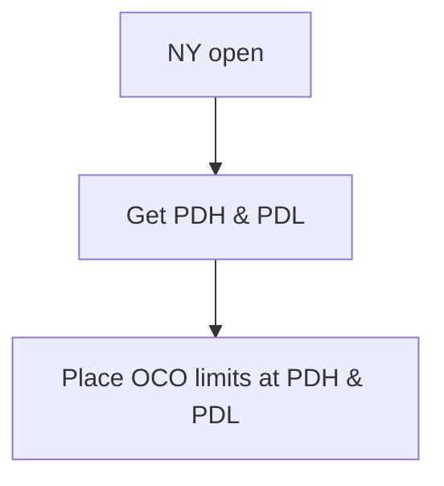

# Prior Day Reversal

## Intro

> This is just trading reversals of previous day high/low on ES and GC.
>
> 1. mark out the previous day high and low
> 2. enter short if price taps PDH, enter long if price tals PDL.

Keeping it simple. I like that. Let's talk about a few technicalities first:

1. `ES` and `GC` are a PITA to collect data for on their own, but we can work around that by using OANDA's `SPX500_USD` and `XAU_USD`, which follow the same indices as `ES` and `GC`, respectively. OANDA's data is free-to-use for essentially any purpose, so we're going to be working with that instead.
2. We still don't have an idea of SL and TP values on each entry, so that needs to get sorted _before_ we can start backtesting.

## First Test

I'll take the naive approach first, setting the SL and TP to `1/2*(PDH-PDL)`, or _prior day range_ in English. This will give us an idea of how often this concept alone succeeds. I'll start with a modest 5 years (start of 2020 to start of 2025) which gives us this:

First, `XAU_USD`:

```
$ python prolefoto/prior_day_reversal.py
2025-08-23 21:21:47,071 - INFO - Starting Prior Day Reversal Strategy
2025-08-23 21:21:47,071 - INFO - Connected to OANDA
2025-08-23 21:21:47,081 - INFO - Data feeds added
2025-08-23 21:21:47,081 - INFO - Starting Portfolio Value: 100000.00
2025-08-23 21:21:47,081 - INFO - Running the strategy
2025-08-23 21:22:13,106 - INFO - Strategy run completed
2025-08-23 21:22:13,106 - INFO - Final Portfolio Value: 99905.88
2025-08-23 21:22:13,113 - INFO - Sharpe Ratio: -16.462564900286527
2025-08-23 21:22:13,113 - INFO - Max Drawdown: 0.51%
2025-08-23 21:22:13,113 - INFO - Trades executed: 17766
2025-08-23 21:22:13,113 - INFO - Number of winning trades: 8891
2025-08-23 21:22:13,113 - INFO - Number of losing trades: 8875
2025-08-23 21:22:13,113 - INFO - Win rate: 50.05%
```

Second, `SPX500_USD`:

```
$ python prolefoto/prior_day_reversal.py
2025-08-23 21:23:33,663 - INFO - Starting Prior Day Reversal Strategy
2025-08-23 21:23:33,663 - INFO - Connected to OANDA
2025-08-23 21:23:33,672 - INFO - Data feeds added
2025-08-23 21:23:33,672 - INFO - Starting Portfolio Value: 100000.00
2025-08-23 21:23:33,672 - INFO - Running the strategy
2025-08-23 21:23:58,370 - INFO - Strategy run completed
2025-08-23 21:23:58,370 - INFO - Final Portfolio Value: 101149.00
2025-08-23 21:23:58,377 - INFO - Sharpe Ratio: -2.1314923385295037
2025-08-23 21:23:58,377 - INFO - Max Drawdown: 0.90%
2025-08-23 21:23:58,377 - INFO - Trades executed: 17895
2025-08-23 21:23:58,377 - INFO - Number of winning trades: 8687
2025-08-23 21:23:58,377 - INFO - Number of losing trades: 9208
2025-08-23 21:23:58,377 - INFO - Win rate: 48.54%
```

My first impressions aren't very good. A 50% winrate is tradable, sure, but only with higher-R entries. At 1R, we're doing about as well as a coinflip (worse, even in the case of `ES`/`SPX500_USD`). That isn't good news. I'll mess around with trailing stops next to see if I can squeeze something out of this consistent winrate.

## Overtrading

Coming back to yesterday's problem with a clear head, there's no way a system like this should be trading any more than `272 * 5 = 1360` times on a 5 year backtest. I'm going to go back over the logic and see what I can do.

Starting off, `if self.dataclose[0] >= self.pdh` checks _only_ for whether price closed above PDH. This is happening on the 15m candles, so that will only happen rarely - if ever. I've never used it before, but Backtrader supports something similar to tick-by-tick replays. If reducing `data0`'s granularity doesn't work, that's what I'll try next.

First test leaves all the logic the same but reduces the `data0` time frame (the one we're trading on) to 1m:

XAU_USD:

```
> python prolefoto/prior_day_reversal.py
2025-08-24 11:48:52,674 - INFO - Starting Prior Day Reversal Strategy
2025-08-24 11:48:52,674 - INFO - Connected to OANDA
2025-08-24 11:48:52,683 - INFO - Data feeds added
2025-08-24 11:48:52,683 - INFO - Starting Portfolio Value: 100000.00
2025-08-24 11:48:52,683 - INFO - Running the strategy
2025-08-24 11:56:21,147 - INFO - Strategy run completed
2025-08-24 11:56:21,147 - INFO - Final Portfolio Value: 99872.47
2025-08-24 11:56:21,261 - INFO - Sharpe Ratio: -13.321357329311633
2025-08-24 11:56:21,261 - INFO - Max Drawdown: 0.45%
2025-08-24 11:56:21,261 - INFO - Trades executed: 265792
2025-08-24 11:56:21,261 - INFO - Number of winning trades: 131712
2025-08-24 11:56:21,261 - INFO - Number of losing trades: 134080
2025-08-24 11:56:21,261 - INFO - Win rate: 49.55%
```

I'm not going to bother testing this same code on the S&P. I somehow managed to trade nearly 200 times a day for 5 years.

```
>>> 265792 / (272 * 5)
195.43529411764706
```

The granularity doesn't seem to be the problem, despite the ~20x increase in trade count. I have a feeling the trading logic itself is flawed. Time to get to work.

### Brief aside and confession

Okay here's the thing: I didn't write all of the trading logic myself. I started typing and Copilot came up with an entire `next` function on its own so I thought "What the hell, let's give it a try". Hindsight being 20/20, that was a mistake. I hate to admit it, but I think Copilot might be turning me into a braindead vibe coder...

### Solution

Now's the part where most people would just feel bad about themselves for relying too heavily on text completion algorithms like Copilot/GPT. Not me, though, 'cause now I get to write my own code! /s

Here's what I want the strategy to do:



I'm looking at `trades.csv` right now and I've noticed a really funny pattern: The strategy is somehow placing 0-size trades every second minute of every day. What the actual hell!?

That means two things: The code isn't doing what I want it to and I'm glad no one else knows it. Let's walk through the code and see how badly Copilot fucked me here:

```python
if not self.position:
    if self.dataclose[0] >= self.pdh:               # this is actually fine if dataclose uses a low timeframe (10s-5m)
        size = 1
        self.order = self.sell(size=size)           # it's just... not making brackets at all? wtf?
        range_size = self.pdh - self.pdl
        self.stop_price = self.dataclose[0] + (     # great. at least it *knows* the bracket size
            range_size * self.p.stop_loss_perc
        )
        self.target_price = self.dataclose[0] - (
            range_size * self.p.profit_target_perc
        )
    elif self.dataclose[0] <= self.pdl:
        size = 1
        self.order = self.buy(size=size)
        range_size = self.pdh - self.pdl
        self.stop_price = self.dataclose[0] - (
            range_size * self.p.stop_loss_perc
        )
        self.target_price = self.dataclose[0] + (
            range_size * self.p.profit_target_perc
        )
else:                                               # backtrader uses positive and negative position size
    if self.position.size > 0:                      # depending on side, so this is only checking for longs right now
        if self.dataclose[0] <= self.target_price:
            self.close()                            # we shouldn't manually close EVER! that's what brackets are for
        elif self.dataclose[0] >= self.stop_price:
            self.close()
    elif self.position.size < 0:
        if self.dataclose[0] >= self.target_price:
            self.close()
        elif self.dataclose[0] <= self.stop_price:
            self.close()
```

So basically, it's time to completely rewrite the trading logic. I get the feeling Copilot doesn't know how to read docs, which is ironic since the Backtrader source has been public on GH since 2015.

### Post-hiatus clarity

I'm coming back to this after a few days and... wow. I managed to make a buggy mess. Somehow, something as simple as writing data to `trades.csv` is failing. Let me get to work...

It only took a couple minutes to fix the `trades.csv` writer bug and... wow. Somehow, it's exiting at 0 on every trade. Meaning there's some weird shit going on with my limits/stops. Let's add some more logging lines to see what's going on. I'm getting tired of pasting logs here, so I'll just explain what the problem is: the entry orders are being treated as market orders, not limits. I'm still not sure _why_, since I'm explicitly defining them as limits, but I'll do some investigating...

Just found out my manual OCO was fucked, so I've gotta fix that first.

Okay, order placement and execution issues have (largely) been solved. I'm sure I'll run into them again as this evolves, but we're placing and cancelling the right orders at the right times. Now, the issue is why they're getting filled at awkward prices. I'll start by reducing the time span I'm testing on. Running over the course of a year takes too long for debugging. Let's do a month.

Here, have a log:

```
2025-09-02 12:32:40,363 - INFO - Strategy run completed
2025-09-02 12:32:40,363 - INFO - Final Portfolio Value: 99947.58
2025-09-02 12:32:40,363 - INFO - Sharpe Ratio: None
2025-09-02 12:32:40,363 - INFO - Max Drawdown: 0.07%
2025-09-02 12:32:40,363 - INFO - Trades executed: 16
2025-09-02 12:32:40,363 - INFO - Number of winning trades: 7
2025-09-02 12:32:40,363 - INFO - Number of losing trades: 9
2025-09-02 12:32:40,363 - INFO - Win rate: 43.75%
2025-09-02 12:32:40,363 - INFO - Net Profit: -52.42
2025-09-02 12:32:40,363 - INFO - Profit Factor: -1.0
2025-09-02 12:32:40,363 - INFO - Saving transactions to trades.csv
2025-09-02 12:32:40,365 - INFO - Transactions saved to trades.csv
```

The above backtest ran through the month of August 2025 on XAU_USD. I wound up re-running it with the number of bars in market to give me an idea of each position's time-to-live.

```
2025-09-02 12:36:08,054 - INFO - Average number of bars in the market: 232.5
2025-09-02 12:36:08,054 - INFO - Longest time in the market: 390 bars
2025-09-02 12:36:08,054 - INFO - Shortest time in the market: 1 bars
```

Considering these are based on 1m candles, we're spending an average of (`232.5 / 60 = 3.875 = 3:52:30`) 3 hours, 52 minutes, and 30 seconds in each position. The shortest time was 1 minute and the longest was 6 and a half hours. Without even checking the price values, this seems to be doing what it's meant to. Now to see if we can optimize the parameters (remember, my SL and TP are both `0.5 * PDR`). I'll bring the backtest time back to 1 year now that things seem to be working well. I still don't know _how_ I was filling at weird prices, but it probably had to do with my manual OCO bug.

## Optimization

Let's go crazy and start with `SL = 0.1 * PDR` and `TP = 1.0 * PDR`. In theory, we should be 10x as likely to hit our SL before our TP. This _should_ result in a roughly 10% win rate. If it's any greater, there's a chance the entire strategy could be automated for long-term profits.

Gold just finished, so let's check it out:

```
2025-09-02 12:45:31,361 - INFO - Strategy run completed
2025-09-02 12:45:31,361 - INFO - Final Portfolio Value: 99998.89
2025-09-02 12:45:31,361 - INFO - Sharpe Ratio: None
2025-09-02 12:45:31,361 - INFO - Max Drawdown: 0.06%
2025-09-02 12:45:31,361 - INFO - Trades executed: 194
2025-09-02 12:45:31,361 - INFO - Number of winning trades: 64
2025-09-02 12:45:31,361 - INFO - Number of losing trades: 130
2025-09-02 12:45:31,361 - INFO - Win rate: 32.99%
2025-09-02 12:45:31,361 - INFO - Average number of bars in the market: 52.78350515463917
2025-09-02 12:45:31,361 - INFO - Longest time in the market: 390 bars
2025-09-02 12:45:31,361 - INFO - Shortest time in the market: 1 bars
2025-09-02 12:45:31,362 - INFO - Net Profit: -1.11
2025-09-02 12:45:31,362 - INFO - Profit Factor: -1.0
2025-09-02 12:45:31,362 - INFO - Saving transactions to trades.csv
2025-09-02 12:45:31,365 - INFO - Transactions saved to trades.csv
```

Now that's the kind of WR I was looking for, but we're still losing overall. Let me take a look at `trades.csv`, as janky as its formatting is.

Looks like stops are getting filled correctly, but limits are too far out to get filled before the close. Makes sense to me. Let's pull TP back a little. 90% PDR, maybe?

```
2025-09-02 13:04:18,514 - INFO - Starting Prior Day Reversal Strategy
2025-09-02 13:04:18,514 - INFO - Connected to OANDA
2025-09-02 13:04:18,523 - INFO - Data feeds added
2025-09-02 13:04:18,523 - INFO - Starting Portfolio Value: 100000.00
2025-09-02 13:04:18,523 - INFO - Running the strategy
2025-09-02 13:04:18,615 - INFO - Prior Day Reversal Strategy initialized
2025-09-02 13:04:18,615 - INFO - Stop Loss Percentage: 10.0%
2025-09-02 13:04:18,615 - INFO - Profit Target Percentage: 90.0%
2025-09-02 13:05:39,447 - INFO - Strategy run completed
2025-09-02 13:05:39,447 - INFO - Final Portfolio Value: 100002.89
2025-09-02 13:05:39,447 - INFO - Sharpe Ratio: None
2025-09-02 13:05:39,447 - INFO - Max Drawdown: 0.06%
2025-09-02 13:05:39,447 - INFO - Trades executed: 194
2025-09-02 13:05:39,447 - INFO - Number of winning trades: 64
2025-09-02 13:05:39,447 - INFO - Number of losing trades: 130
2025-09-02 13:05:39,447 - INFO - Win rate: 32.99%
2025-09-02 13:05:39,447 - INFO - Average number of bars in the market: 51.371134020618555
2025-09-02 13:05:39,447 - INFO - Longest time in the market: 390 bars
2025-09-02 13:05:39,447 - INFO - Shortest time in the market: 1 bars
2025-09-02 13:05:39,447 - INFO - Net Profit: 2.89
2025-09-02 13:05:39,448 - INFO - Profit Factor: N/A
2025-09-02 13:05:39,448 - INFO - Saving transactions to trades.csv
2025-09-02 13:05:39,451 - INFO - Transactions saved to trades.csv
```

Good news! We made $2.89 over the course of 272 trading sessions! We're rich!

Honestly, though, I think this is PoC enough to increase the risk a little. How about 1% account balance per trade? After a brief intermission setting up the right leverage and margin parameters (per OANDA's website), we're off to run another test.

```
2025-09-02 13:14:34,981 - INFO - Starting Prior Day Reversal Strategy
2025-09-02 13:14:34,981 - INFO - Connected to OANDA
2025-09-02 13:14:34,991 - INFO - Data feeds added
2025-09-02 13:14:34,991 - INFO - Starting Portfolio Value: 100000.00
2025-09-02 13:14:34,991 - INFO - Running the strategy
2025-09-02 13:14:35,221 - INFO - Prior Day Reversal Strategy initialized
2025-09-02 13:14:35,222 - INFO - Stop Loss Percentage: 10.0%
2025-09-02 13:14:35,222 - INFO - Profit Target Percentage: 90.0%
2025-09-02 13:16:04,266 - INFO - Strategy run completed
2025-09-02 13:16:04,266 - INFO - Final Portfolio Value: 94389.31
2025-09-02 13:16:04,266 - INFO - Sharpe Ratio: None
2025-09-02 13:16:04,266 - INFO - Max Drawdown: 24.46%
2025-09-02 13:16:04,266 - INFO - Trades executed: 194
2025-09-02 13:16:04,266 - INFO - Number of winning trades: 64
2025-09-02 13:16:04,266 - INFO - Number of losing trades: 130
2025-09-02 13:16:04,266 - INFO - Win rate: 32.99%
2025-09-02 13:16:04,266 - INFO - Average number of bars in the market: 51.371134020618555
2025-09-02 13:16:04,266 - INFO - Longest time in the market: 390 bars
2025-09-02 13:16:04,266 - INFO - Shortest time in the market: 1 bars
2025-09-02 13:16:04,266 - INFO - Net Profit: -5610.69
2025-09-02 13:16:04,266 - INFO - Profit Factor: -1.0
2025-09-02 13:16:04,266 - INFO - Saving transactions to trades.csv
2025-09-02 13:16:04,270 - INFO - Transactions saved to trades.csv
```

Ouch. I guess our 32% WR isn't quite enough, likely because we aren't hitting our TP, just closing at 16:00. Time to bring the TP down another notch. Let's try 50% to see if we could _ever_ win this way.

```
2025-09-02 13:19:18,010 - INFO - Starting Prior Day Reversal Strategy
2025-09-02 13:19:18,010 - INFO - Connected to OANDA
2025-09-02 13:19:18,019 - INFO - Data feeds added
2025-09-02 13:19:18,019 - INFO - Starting Portfolio Value: 100000.00
2025-09-02 13:19:18,019 - INFO - Running the strategy
2025-09-02 13:19:18,145 - INFO - Prior Day Reversal Strategy initialized
2025-09-02 13:19:18,146 - INFO - Stop Loss Percentage: 10.0%
2025-09-02 13:19:18,146 - INFO - Profit Target Percentage: 50.0%
2025-09-02 13:20:41,179 - INFO - Strategy run completed
2025-09-02 13:20:41,179 - INFO - Final Portfolio Value: 99681.10
2025-09-02 13:20:41,179 - INFO - Sharpe Ratio: None
2025-09-02 13:20:41,179 - INFO - Max Drawdown: 17.75%
2025-09-02 13:20:41,179 - INFO - Trades executed: 194
2025-09-02 13:20:41,179 - INFO - Number of winning trades: 66
2025-09-02 13:20:41,179 - INFO - Number of losing trades: 128
2025-09-02 13:20:41,179 - INFO - Win rate: 34.02%
2025-09-02 13:20:41,179 - INFO - Average number of bars in the market: 42.93814432989691
2025-09-02 13:20:41,179 - INFO - Longest time in the market: 390 bars
2025-09-02 13:20:41,179 - INFO - Shortest time in the market: 1 bars
2025-09-02 13:20:41,179 - INFO - Net Profit: -318.90
2025-09-02 13:20:41,179 - INFO - Profit Factor: -1.0
2025-09-02 13:20:41,179 - INFO - Saving transactions to trades.csv
2025-09-02 13:20:41,183 - INFO - Transactions saved to trades.csv
```

That's... better? I still don't like it. Part of me wants to blame backtrader, but the rest of me honestly thinks this strategy is better off discretionary and not automated. I'll try 30% next, though. That _could_ get us somewhere.

```
2025-09-02 13:23:22,337 - INFO - Starting Prior Day Reversal Strategy
2025-09-02 13:23:22,337 - INFO - Connected to OANDA
2025-09-02 13:23:22,346 - INFO - Data feeds added
2025-09-02 13:23:22,346 - INFO - Starting Portfolio Value: 100000.00
2025-09-02 13:23:22,346 - INFO - Running the strategy
2025-09-02 13:23:22,479 - INFO - Prior Day Reversal Strategy initialized
2025-09-02 13:23:22,479 - INFO - Stop Loss Percentage: 10.0%
2025-09-02 13:23:22,479 - INFO - Profit Target Percentage: 30.0%
2025-09-02 13:24:42,495 - INFO - Strategy run completed
2025-09-02 13:24:42,495 - INFO - Final Portfolio Value: 94261.26
2025-09-02 13:24:42,495 - INFO - Sharpe Ratio: None
2025-09-02 13:24:42,495 - INFO - Max Drawdown: 19.70%
2025-09-02 13:24:42,495 - INFO - Trades executed: 194
2025-09-02 13:24:42,495 - INFO - Number of winning trades: 67
2025-09-02 13:24:42,495 - INFO - Number of losing trades: 127
2025-09-02 13:24:42,495 - INFO - Win rate: 34.54%
2025-09-02 13:24:42,495 - INFO - Average number of bars in the market: 28.577319587628867
2025-09-02 13:24:42,495 - INFO - Longest time in the market: 390 bars
2025-09-02 13:24:42,495 - INFO - Shortest time in the market: 1 bars
2025-09-02 13:24:42,495 - INFO - Net Profit: -5738.74
2025-09-02 13:24:42,495 - INFO - Profit Factor: -1.0
2025-09-02 13:24:42,496 - INFO - Saving transactions to trades.csv
2025-09-02 13:24:42,499 - INFO - Transactions saved to trades.csv
```

Unsurprisingly, that did _much_ worse than 50%. You can sort of prove this mathematically based on our win rate:

> Since WR is approximately 1/3 (33.33%), that means we would need to win more than 3x what we would lose. Currently, we barely scratch past 33% WR, but we only win 3x (30% / 10%) our risk when we do. This makes the strategy essentially breakeven at these parameters..
