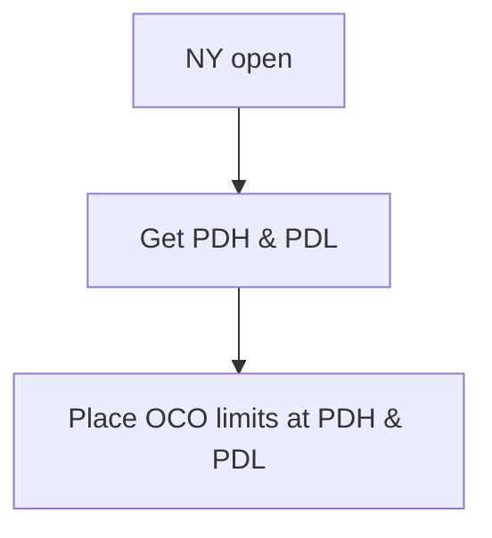

# Prior Day Reversal

## Intro

> This is just trading reversals of previous day high/low on ES and GC.
>
> 1. mark out the previous day high and low
> 2. enter short if price taps PDH, enter long if price tals PDL.

Keeping it simple. I like that. Let's talk about a few technicalities first:

1. `ES` and `GC` are a PITA to collect data for on their own, but we can work around that by using OANDA's `SPX500_USD` and `XAU_USD`, which follow the same indices as `ES` and `GC`, respectively. OANDA's data is free-to-use for essentially any purpose, so we're going to be working with that instead.
2. We still don't have an idea of SL and TP values on each entry, so that needs to get sorted _before_ we can start backtesting.

## First Test

I'll take the naive approach first, setting the SL and TP to `1/2*(PDH-PDL)`, or _prior day range_ in English. This will give us an idea of how often this concept alone succeeds. I'll start with a modest 5 years (start of 2020 to start of 2025) which gives us this:

First, `XAU_USD`:

```
$ python prolefoto/prior_day_reversal.py
2025-08-23 21:21:47,071 - INFO - Starting Prior Day Reversal Strategy
2025-08-23 21:21:47,071 - INFO - Connected to OANDA
2025-08-23 21:21:47,081 - INFO - Data feeds added
2025-08-23 21:21:47,081 - INFO - Starting Portfolio Value: 100000.00
2025-08-23 21:21:47,081 - INFO - Running the strategy
2025-08-23 21:22:13,106 - INFO - Strategy run completed
2025-08-23 21:22:13,106 - INFO - Final Portfolio Value: 99905.88
2025-08-23 21:22:13,113 - INFO - Sharpe Ratio: -16.462564900286527
2025-08-23 21:22:13,113 - INFO - Max Drawdown: 0.51%
2025-08-23 21:22:13,113 - INFO - Trades executed: 17766
2025-08-23 21:22:13,113 - INFO - Number of winning trades: 8891
2025-08-23 21:22:13,113 - INFO - Number of losing trades: 8875
2025-08-23 21:22:13,113 - INFO - Win rate: 50.05%
```

Second, `SPX500_USD`:

```
$ python prolefoto/prior_day_reversal.py
2025-08-23 21:23:33,663 - INFO - Starting Prior Day Reversal Strategy
2025-08-23 21:23:33,663 - INFO - Connected to OANDA
2025-08-23 21:23:33,672 - INFO - Data feeds added
2025-08-23 21:23:33,672 - INFO - Starting Portfolio Value: 100000.00
2025-08-23 21:23:33,672 - INFO - Running the strategy
2025-08-23 21:23:58,370 - INFO - Strategy run completed
2025-08-23 21:23:58,370 - INFO - Final Portfolio Value: 101149.00
2025-08-23 21:23:58,377 - INFO - Sharpe Ratio: -2.1314923385295037
2025-08-23 21:23:58,377 - INFO - Max Drawdown: 0.90%
2025-08-23 21:23:58,377 - INFO - Trades executed: 17895
2025-08-23 21:23:58,377 - INFO - Number of winning trades: 8687
2025-08-23 21:23:58,377 - INFO - Number of losing trades: 9208
2025-08-23 21:23:58,377 - INFO - Win rate: 48.54%
```

My first impressions aren't very good. A 50% winrate is tradable, sure, but only with higher-R entries. At 1R, we're doing about as well as a coinflip (worse, even in the case of `ES`/`SPX500_USD`). That isn't good news. I'll mess around with trailing stops next to see if I can squeeze something out of this consistent winrate.

## Overtrading

Coming back to yesterday's problem with a clear head, there's no way a system like this should be trading any more than `272 * 5 = 1360` times on a 5 year backtest. I'm going to go back over the logic and see what I can do.

Starting off, `if self.dataclose[0] >= self.pdh` checks _only_ for whether price closed above PDH. This is happening on the 15m candles, so that will only happen rarely - if ever. I've never used it before, but Backtrader supports something similar to tick-by-tick replays. If reducing `data0`'s granularity doesn't work, that's what I'll try next.

First test leaves all the logic the same but reduces the `data0` time frame (the one we're trading on) to 1m:

XAU_USD:

```
> python prolefoto/prior_day_reversal.py
2025-08-24 11:48:52,674 - INFO - Starting Prior Day Reversal Strategy
2025-08-24 11:48:52,674 - INFO - Connected to OANDA
2025-08-24 11:48:52,683 - INFO - Data feeds added
2025-08-24 11:48:52,683 - INFO - Starting Portfolio Value: 100000.00
2025-08-24 11:48:52,683 - INFO - Running the strategy
2025-08-24 11:56:21,147 - INFO - Strategy run completed
2025-08-24 11:56:21,147 - INFO - Final Portfolio Value: 99872.47
2025-08-24 11:56:21,261 - INFO - Sharpe Ratio: -13.321357329311633
2025-08-24 11:56:21,261 - INFO - Max Drawdown: 0.45%
2025-08-24 11:56:21,261 - INFO - Trades executed: 265792
2025-08-24 11:56:21,261 - INFO - Number of winning trades: 131712
2025-08-24 11:56:21,261 - INFO - Number of losing trades: 134080
2025-08-24 11:56:21,261 - INFO - Win rate: 49.55%
```

I'm not going to bother testing this same code on the S&P. I somehow managed to trade nearly 200 times a day for 5 years.

```
>>> 265792 / (272 * 5)
195.43529411764706
```

The granularity doesn't seem to be the problem, despite the ~20x increase in trade count. I have a feeling the trading logic itself is flawed. Time to get to work.

### Brief aside and confession

Okay here's the thing: I didn't write all of the trading logic myself. I started typing and Copilot came up with an entire `next` function on its own so I thought "What the hell, let's give it a try". Hindsight being 20/20, that was a mistake. I hate to admit it, but I think Copilot might be turning me into a braindead vibe coder...

### Solution

Now's the part where most people would just feel bad about themselves for relying too heavily on text completion algorithms like Copilot/GPT. Not me, though, 'cause now I get to write my own code! /s

Here's what I want the strategy to do:



I'm looking at `trades.csv` right now and I've noticed a really funny pattern: The strategy is somehow placing 0-size trades every second minute of every day. What the actual hell!?
